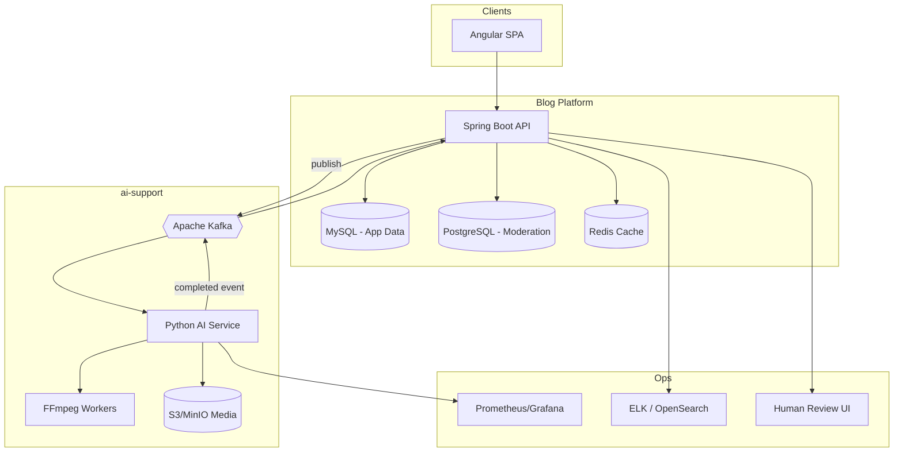
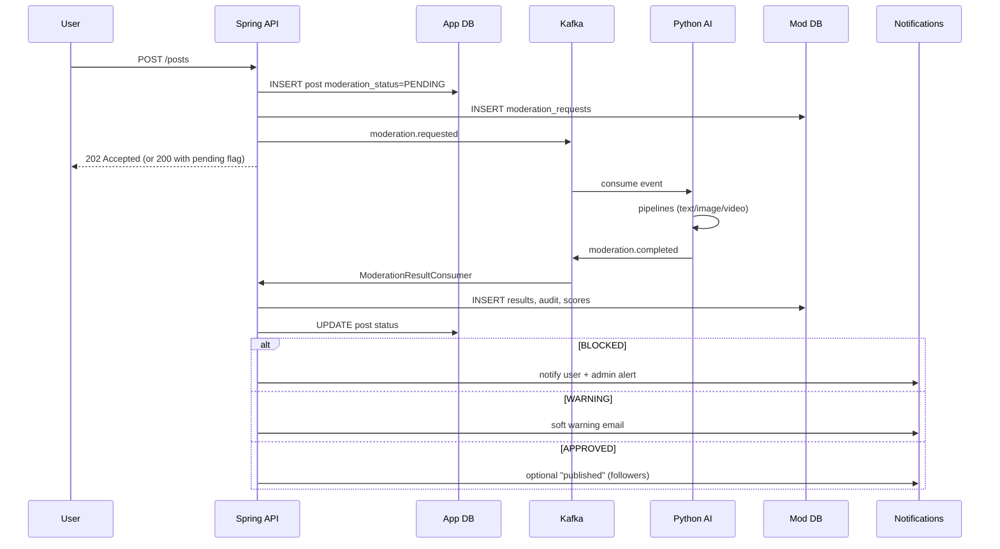
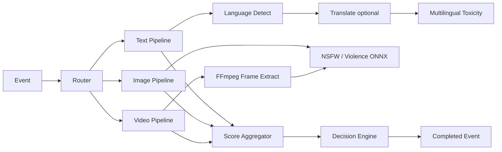
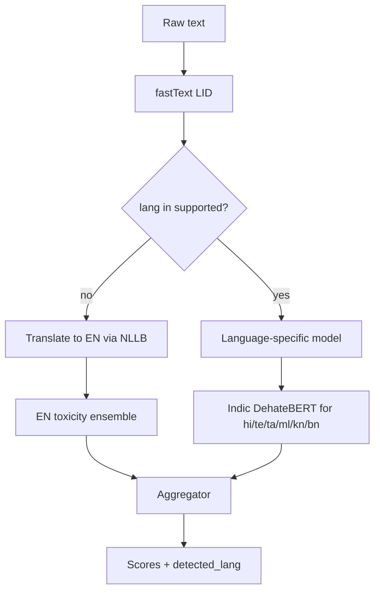

# Enterprise AI Content Moderation Architecture

**Version:** 1.0  
**Scope:** `Backend/ai-support` — independent AI Safety module for Blog Management System  
**Orchestrator:** Java Spring Boot 3.1 (`Blog_mng_*`)  
**AI Engine:** Python FastAPI microservice (`python-ai-service`)

---

## 1. Executive summary

The platform implements **async, event-driven content moderation** for posts, comments, profiles, and media. User-facing APIs never block on GPU inference; content is stored as `PENDING_MODERATION`, analyzed by horizontally scaled Python workers, then transitioned to `APPROVED`, `WARNING`, or `BLOCKED` with full audit trails.

Design principles:

| Principle | Implementation |
|-----------|----------------|
| Modularity | Separate `ai-support` repo area; contracts in `contracts/` |
| Scalability | Kafka partitions by `content_type`; AI worker HPA on CPU/GPU queue lag |
| Security | Service JWT, optional mTLS, presigned media URLs, no public AI admin |
| Observability | Structured logs, Prometheus metrics, OpenTelemetry traces |
| Evolvability | Plugin pipelines per modality; model version in `moderation_results` |

---

## 2. System context (C4 Level 1)



---

## 3. Logical architecture (C4 Level 2)

### 3.1 Layers

```
┌─────────────────────────────────────────────────────────────┐
│ Presentation (Angular)                                     │
│  - Show moderation state badges                              │
│  - Hide BLOCKED content; soft-warning for WARNING            │
└───────────────────────────┬─────────────────────────────────┘
                            │ HTTPS
┌───────────────────────────▼─────────────────────────────────┐
│ Application (Spring Boot - Blog_mng_api / Blog_mng_sevice)   │
│  - ModerationOrchestrator                                    │
│  - ContentModerationGateway (Kafka producer)                 │
│  - ModerationResultConsumer                                  │
│  - ModerationStatusService                                   │
│  - NotificationBridge (existing NotificationService)         │
└───────────────────────────┬─────────────────────────────────┘
                            │ Kafka + JDBC
┌───────────────────────────▼─────────────────────────────────┐
│ AI Safety Module (ai-support)                                │
│  Java: java-integration/samples                              │
│  Python: python-ai-service (FastAPI + workers)               │
│  DB: database/schema.postgresql.sql                          │
└─────────────────────────────────────────────────────────────┘
```

### 3.2 Why Java orchestrates, Python infers

| Concern | Java | Python |
|---------|------|--------|
| Transactional writes to `posts`/`comments`/`users` | ✓ Primary | ✗ |
| AuthZ, rate limits, existing JWT | ✓ | Internal only |
| Heavy ML (transformers, ONNX, OpenCV) | ✗ | ✓ |
| Fast iteration on models | Slow release cycle | ✓ |

**Tradeoff:** Two runtimes increase ops surface; mitigated by Docker/K8s and shared event contracts.

---

## 4. Moderation triggers (content types)

| # | Trigger | `content_type` | Fields analyzed |
|---|---------|----------------|-----------------|
| 1 | Post create | `POST` | title, content, tags, hashtags, mentions, imageUrl, mediaUrl |
| 2 | Post update | `POST` | delta + media |
| 3 | Comment create | `COMMENT` | content, mentions |
| 4 | Comment update | `COMMENT` | content |
| 5 | Profile create | `USER_PROFILE` | userName, fullName, bio |
| 6 | Profile update | `USER_PROFILE` | same |
| 7 | Bio update | `USER_BIO` | bio |
| 8 | Profile image | `USER_AVATAR` | profileImageUrl |
| 9 | User media upload | `USER_MEDIA` | file from FileController |
| 10+ | Future reels/chat/stories | `REEL`, `CHAT_MESSAGE`, `STORY` | extensible enum |

Each trigger creates one row in `moderation_requests` and one Kafka message.

---

## 5. End-to-end workflow



### 5.1 Synchronous vs asynchronous paths

| Path | When | Latency target |
|------|------|----------------|
| **Async (default)** | Posts, comments with media, videos | p95 < 30s (text/image), minutes (video) |
| **Sync** | Username at register, short bio preview | p95 < 300ms (cached + small model) |

Sync calls: `POST /api/v1/moderate/sync` on Python (see OpenAPI). Java `ModerationSyncClient` with 2s timeout and circuit breaker (Resilience4j).

---

## 6. Kafka vs RabbitMQ recommendation

### Recommendation: **Apache Kafka** (primary)

**Why (for your project):**

1. **Already integrated** — `ChatKafkaDeliveryBridge`, `spring-kafka`, topics in `application.properties`.
2. **Replay** — Re-run moderation after model upgrade by resetting consumer offset or compacted replay topic.
3. **Throughput** — High fan-out for viral posts; partition by `content_id` hash.
4. **Audit** — Event log aligns with compliance retention policies.

### When RabbitMQ would win

- Smaller team, simpler ops, strict per-message TTL and classic DLQ patterns without stream semantics.
- Moderation volume < 1k/min and no replay requirement.

**Hybrid (enterprise):** Kafka for `moderation.requested` / `moderation.completed`; RabbitMQ optional for **human-review task assignment** if you prefer AMQP work queues. Not required for v1.

### Topic design

| Topic | Partitions | Key | Retention |
|-------|------------|-----|-----------|
| `moderation.requested` | 12 | `{contentType}:{contentId}` | 7d |
| `moderation.completed` | 12 | `requestId` | 30d |
| `moderation.dlq` | 3 | `requestId` | 90d |
| `moderation.priority.high` | 6 | same | 7d (VIP/report-abuse) |

Consumer groups:

- `ai-moderation-workers` (Python, scale N)
- `blog-moderation-result-applier` (Java, single logical group, multiple instances for HA)

### Retry & DLQ

1. Python consumer: max 3 retries with exponential backoff (1s, 4s, 16s).
2. On failure → `moderation.dlq` with headers: `x-error`, `x-request-id`, `x-retry-count`.
3. Java **DLQ reprocessor** job (scheduled) for transient failures only.
4. Idempotency: `moderation_requests.idempotency_key` UNIQUE — duplicate events ignored.

---

## 7. Database architecture

**Recommendation:** Dedicated **PostgreSQL** database `moderation_db` for moderation tables (JSONB scores, GIN indexes). App entities (`posts`, `comments`, `users`) stay on **MySQL** with lightweight columns:

```sql
ALTER TABLE posts ADD COLUMN moderation_status VARCHAR(32) DEFAULT 'APPROVED';
ALTER TABLE posts ADD COLUMN moderation_request_id UUID NULL;
```

Full moderation schema: `database/schema.postgresql.sql`.

### Entity relationships (summary)

```
moderation_requests 1──* moderation_results
moderation_requests 1──* moderation_scores
moderation_requests 1──* moderation_audit_logs
moderation_requests *──1 moderation_queue (optional scheduling)
moderation_results  *──1 ai_model_metadata (by model_version)
moderation_actions  *──1 moderation_requests (human overrides)
```

---

## 8. AI pipeline design (modular)



### 8.1 Text pipeline

1. Normalize (NFKC, strip zero-width, URL extraction).
2. **Language detect** — `fastText lid.176` or `langdetect` + `fasttext` fallback.
3. If not `en`: optional translate-to-en via **NLLB-200-distilled-600M** (GPU) or **IndicTrans2** for Indian languages.
4. Run ensemble:
   - `unitary/toxic-bert` (en)
   - `Hate-speech-CNERG/dehatebert-mono-indic` (hi + indic)
   - `facebook/roberta-hate-speech-dynabench-r4-target` (en hate)
   - Regex/heuristics: threats, spam URLs, crypto scam patterns
5. Per-label scores → `moderation_scores` rows.

### 8.2 Image pipeline

1. Download from presigned URL (never trust client path).
2. Hash (pHash) → Redis dedup cache.
3. **ONNX** models: `GantMan/nsfw_model` (NSFW), `Falconsai/nsfw_image_detection` (HF), violence via `microsoft/resnet-50` fine-tune or dedicated violence checkpoint.
4. OCR optional (`easyocr`) for text-in-image abuse.

### 8.3 Video pipeline

1. Job queued to `moderation.priority.high` if duration < 60s else standard.
2. FFmpeg: 1 fps sample (configurable), max 120 frames, resize 224×224.
3. Batch inference on frames (GPU batch 32).
4. Aggregate: `max(frame_scores)`, `percentile_95`, `weighted_mean`.
5. Store `video_frame_count`, `frames_analyzed` in result metadata.

**Large video strategy:** Chunk processing on dedicated `video-worker` pool; progress in `moderation_queue.progress_pct`.

---

## 9. Decision engine & thresholds

See `docs/MODELS-AND-THRESHOLDS.md` for numeric defaults.

| Final status | Rule (simplified) |
|--------------|-------------------|
| `BLOCKED` | Any critical label ≥ block threshold OR impersonation confirmed |
| `WARNING` | Any label in warning band OR needs human review |
| `APPROVED` | All labels below warn threshold |

Comment-specific labels map to: **SAFE** (=APPROVED), **WARNING**, **BLOCKED**.

**Human review:** `needs_review = true` when `0.45 < max_score < 0.72` (configurable per label).

---

## 10. Multi-language workflow



**Supported v1:** en, hi, te, ta, ml, kn, bn, ar + fallback translate.en.

**Why translate + native:** Native Indic models capture cultural slurs; EN models catch romanized abuse ("madarchod" latinized).

---

## 11. Security architecture

| Control | Mechanism |
|---------|-----------|
| Service-to-service auth | JWT signed by internal issuer (`moderation-sa`); audience `ai-moderation` |
| Transport | mTLS in K8s via service mesh (Istio/Linkerd) or cert-manager internal CA |
| Media access | Presigned S3/MinIO URLs, 5 min TTL, IP-bound optional |
| Upload validation | Magic bytes, size caps, ClamAV sidecar before AI |
| AI API exposure | ClusterIP only; ingress only for health/metrics |
| Rate limiting | Redis token bucket per `user_id` on sync endpoints |
| Abuse of moderation API | HMAC webhook secret on callback; reject unsigned |

Details: `docs/MONITORING-SECURITY.md`.

---

## 12. Performance & caching

| Technique | Purpose |
|-----------|---------|
| Redis pHash cache | Skip re-inference for duplicate images |
| Redis text hash | SHA-256 of normalized text → prior result 24h |
| Batch inference | Video frames, bulk comment backfill |
| GPU optional | `--device cuda` env; CPU ONNX quantized models fallback |
| Priority queues | Reports / repeat offenders → high topic |
| Horizontal scale | `kubectl scale deployment ai-moderation-worker --replicas=20` |

**Target SLOs:**

- Text comment: p95 < 2s (async completion)
- Image post: p95 < 8s
- Video 60s: p95 < 90s with 4 GPU workers

---

## 13. Human review system

- Borderline scores → `moderation_queue.status = PENDING_REVIEW`.
- Moderator UI (future Angular module or Retool): claim task, override action in `moderation_actions`.
- Appeals: user submits → new `content_type=APPEAL` request linked to original.
- SLA metrics: time_in_queue, reviewer throughput.

See `docs/HUMAN-REVIEW.md`.

---

## 14. Notifications & email

| Event | Recipient | Channel |
|-------|-----------|---------|
| BLOCKED post | Author | Email + in-app |
| WARNING comment | Author | In-app |
| Repeated blocks | Author + admin | Email alert |
| HIGH severity | Admin slack/webhook | PagerDuty optional |

Integrate via existing `NotificationService` — Java listener calls `notifyModerationOutcome(userId, requestId, status)`.

---

## 15. Monitoring & logging

| Signal | Tool |
|--------|------|
| Metrics | Prometheus (`moderation_requests_total`, `inference_latency_seconds`, `gpu_utilization`) |
| Dashboards | Grafana boards in `docker/grafana/dashboards/` |
| Logs | JSON → ELK/OpenSearch; correlation id = `requestId` |
| Traces | OpenTelemetry Java agent + Python `opentelemetry-instrumentation-fastapi` |
| Errors | Sentry projects: `blog-api`, `ai-moderation` |
| AI quality | Weekly sample audit; precision/recall vs human labels |

---

## 16. Deployment topology

### Docker Compose (dev)

`docker/docker-compose.yml` — Kafka, Zookeeper/KRaft, Redis, PostgreSQL, MinIO, Python AI, Prometheus.

### Kubernetes (prod)

```
Namespace: ai-safety
├── Deployment: ai-moderation-api (FastAPI, HPA on CPU)
├── Deployment: ai-moderation-worker (Kafka consumer, HPA on lag)
├── Deployment: ai-video-worker (GPU node pool)
├── StatefulSet: kafka (or managed MSK/Confluent)
├── Deployment: redis-cluster
├── CronJob: dlq-reprocessor
└── Secret: model-registry-credentials
```

Manifests: `k8s/*.yaml`.

### CI/CD

1. **Java:** existing Maven pipeline + flyway/Liquibase for moderation columns.
2. **Python:** lint (ruff), test (pytest), build image `ghcr.io/org/ai-moderation:${sha}`, scan (Trivy).
3. **Models:** download at image build OR init container from private registry (avoid huge git LFS).

---

## 17. Error handling

| Error class | Action |
|-------------|--------|
| Transient model OOM | Retry, scale workers |
| Bad media URL | FAIL request, audit, default BLOCKED for safety |
| Kafka unavailable | Outbox table in Java; poller publishes when broker up |
| Model timeout | Degrade to heuristic-only text; flag `degraded_mode=true` |
| Poison message | DLQ + alert |

**Outbox pattern (recommended):** `moderation_outbox` in PostgreSQL written in same TX as `moderation_requests`; scheduler publishes to Kafka.

---

## 18. Future scalability

| Feature | Extension |
|---------|-----------|
| Reels | `content_type=REEL`, shorter frame interval |
| Chat | Hook `ChatMessageDeliveredEvent` → moderation before delivery |
| Stories | TTL content; faster priority queue |
| Federated learning | Export blocked samples to labeling pipeline (PII scrubbed) |
| Custom policies | `policy_packs` table + per-tenant thresholds |
| gRPC | Add `contracts/moderation.proto` for lower latency sync |

---

## 19. Folder structure (complete)

```
Backend/ai-support/
├── README.md
├── docs/
│   ├── ARCHITECTURE.md
│   ├── INTEGRATION-GUIDE.md
│   ├── MODELS-AND-THRESHOLDS.md
│   ├── MONITORING-SECURITY.md
│   └── HUMAN-REVIEW.md
├── database/
│   └── schema.postgresql.sql
├── contracts/
│   ├── moderation-event.schema.json
│   └── moderation-api.openapi.yaml
├── java-integration/
│   ├── README.md
│   └── samples/
│       ├── ModerationRequestedEvent.java
│       ├── ModerationCompletedEvent.java
│       ├── ModerationOrchestrator.java
│       ├── ModerationKafkaProducer.java
│       ├── ModerationResultConsumer.java
│       ├── ModerationSyncClient.java
│       ├── PostModerationHook.java
│       └── application-moderation.properties.snippet
├── python-ai-service/
│   ├── Dockerfile
│   ├── requirements.txt
│   └── app/
│       ├── main.py
│       ├── config.py
│       ├── api/routes/moderate.py
│       ├── core/decision_engine.py
│       ├── core/security.py
│       ├── pipelines/text_pipeline.py
│       ├── pipelines/image_pipeline.py
│       ├── pipelines/video_pipeline.py
│       ├── workers/kafka_consumer.py
│       └── models/schemas.py
├── docker/
│   ├── docker-compose.yml
│   └── .env.example
└── k8s/
    ├── namespace.yaml
    ├── configmap.yaml
    ├── python-ai-deployment.yaml
    ├── python-ai-worker-deployment.yaml
    └── hpa.yaml
```

---

## 20. Integration with existing entities

Add to `Post`, `Comment`, `User`:

```java
@Enumerated(EnumType.STRING)
@Column(length = 32)
private ModerationStatus moderationStatus = ModerationStatus.APPROVED;

@Column(name = "moderation_request_id")
private UUID moderationRequestId;
```

Hook in `PostServiceImpl.createPost` **after** `save()`:

```java
moderationOrchestrator.submit(ModerationContentType.POST, saved.getId(), userId, payload);
```

List endpoints filter: `WHERE moderation_status = 'APPROVED' OR (user_id = :viewer AND status != 'BLOCKED')`.

---

## 21. API surface (summary)

| API | Owner | Purpose |
|-----|-------|---------|
| Internal Kafka events | Both | Primary async path |
| `GET /api/v1/moderation/requests/{id}` | Java | Status polling |
| `POST /api/v1/moderate/sync` | Python | Username/bio quick check |
| `POST /api/v1/moderate/batch` | Python | Admin backfill |
| `GET /api/v1/health` | Python | K8s probes |

Full OpenAPI: `contracts/moderation-api.openapi.yaml`.

---

## 22. Tradeoffs summary

| Choice | Benefit | Cost |
|--------|---------|------|
| Kafka | Scale + replay | Ops complexity |
| Separate PG DB | Rich JSONB analytics | Second database |
| Async default | Fast API | Content not instant-live |
| Open-source models | No vendor lock-in | Tuning burden |
| Python AI | ML ecosystem | Two-language team |

---

## 23. Implementation phases

| Phase | Duration | Deliverables |
|-------|----------|--------------|
| **P0** | 2 weeks | Schema, Kafka topics, text-only comments, Java hooks |
| **P1** | 2 weeks | Image NSFW, post/profile, notifications |
| **P2** | 3 weeks | Video pipeline, human review queue |
| **P3** | 2 weeks | Multi-language indic, monitoring, K8s prod |
| **P4** | ongoing | Chat/reels, model refresh automation |

---

*This document is the canonical architecture for the AI Safety module. Implementation samples live in `java-integration/` and `python-ai-service/`.*
